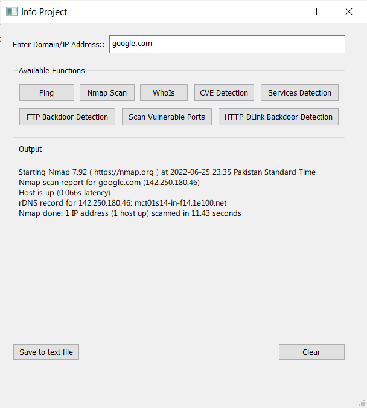

# War-Domain-IP-Ports-Scanner

### Overview

The ‘WAR Network Scanner’ is a script written in Python3 that allows port scanning, backdoor detection, CVE detection, services detection and much more. The program is interactive and simply requires the user to run it via console to begin. The scripts are backed by NMAP and Whois.

### Procedure

- Clone this Repository with command `git clone https://github.com/abdulrauf8788uni/War-Domain-IP-Ports-Scanner`
- Navigate to this folder in powershell / CMD
- Install dependancies wiht command `pip install -r requirements.txt`

### Libraries

- socket
- os
- pyQt5
- sys
- subprocess
- whois11

## Commands:

#### Ping IP command
The ping command is used to identify active hosts on a network. This identifies all of the IP addresses that are currently online without sending any packets to these hosts.

#### Nmap scan
A stealthy scan that detects open ports, scripts, traceroutes, operating system being used and much more.

#### FTP backdoor Detection 
This scan is used to look for exploitable entry points and vulnerabilities that can be used to access a workstation.

#### HTTP-DLink Backdoor Detection
This function tests for the presence of the ProFTPD 1.3.3c backdoor reported as BID 45150. This script attempts to exploit the backdoor using the innocuous id command by default.

#### CVE detection
This command tests the Common Vulnerabilities and Exposures (CVE) in a network and identifies threats related to the security of information systems.

#### Services detection
This scan is used to check for services that are running on an IP/domain along with open ports and the proxy versions they use.

#### Scan vulnerable ports
This function scans the top 10 vulnerable ports that could potentially act as an entry point.

#### Whois Command
This function exports important information about open ports to a text file that is stored in the root directory along with the .py script.

### References:

Back Door Detection:
https://nmap.org/nsedoc/scripts/ftp-proftpd-backdoor.html

NMap for Windows
https://nmap.org/download.html#windows

Important NMap commands 
https://www.jigsawacademy.com/blogs/cyber-security/nmap-commands/

WhoIs Library in Python
https://pypi.org/project/whois11/

Original d9scan
https://github.com/sbinsaleem/d9scan

Python GUI designer
https://realpython.com/qt-designer-python/

### Snapshots 

